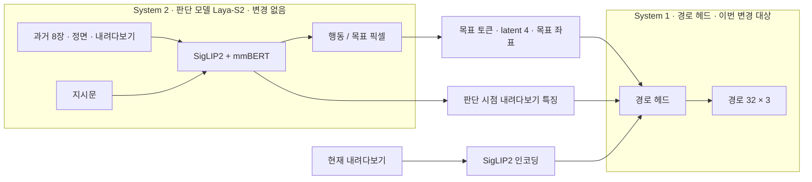
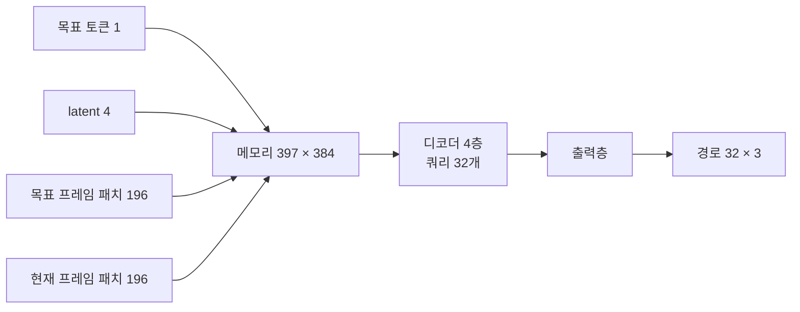
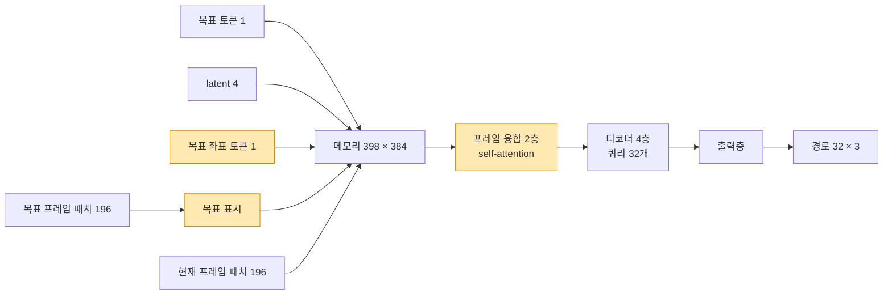

# LayaNav 경로 헤드 구조 (v1 → v2): System 1 개선

> **대상: System 1 (경로 헤드, `traj_*` 모듈).** System 2(판단 모델 Laya-S2)와 공유 이미지 인코더(SigLIP2)는 바꾸지 않았다.
> System 구분 전체는 [구현 보고서 1.1절](../IMPLEMENTATION_REPORT.md#11-system-1--system-2-구분), 현재 개선점과 한계는 [11절](../IMPLEMENTATION_REPORT.md#11-현재-모델의-개선점과-한계-2026-10-06-c2-결과-기준)을 보라.

LayaNav = System 2 판단 모델(Laya-S2) + System 1 경로 헤드(DualVLN System 1 역할).

## 전체 구조

`CF`(현재 내려다보기 인코딩)는 System 2와 같은 SigLIP2 가중치를 쓴다(공유 인코더).

## System 1 경로 헤드 v1 (첫 C1)

메모리 토큰끼리는 attention이 없다. 쿼리 32개가 cross-attention으로 각 토큰을 따로 읽는다.

## System 1 경로 헤드 v2

색칠한 세 곳이 새로 추가된 부분이다.

## 레이어 목록 (System 1 모듈만)

| 모듈 | 역할 | 크기 | 파라미터 | v1 | v2 |
|---|---|---|---|---|---|
| `traj_mem_proj` | 목표 토큰·프레임 패치 투영 | 768 → 384 | 295,296 | ○ | ○ |
| `traj_latent_proj` | latent 투영 | 768 → 384 | 295,296 | ○ | ○ |
| `traj_goal_xy` | 목표 좌표 토큰 (Fourier 특징 → 투영) | 2 → 384 | 24,960 | | **신규** |
| `traj_seg` | 구간 임베딩 (메모리 / 목표 프레임 / 현재 프레임) | 3 × 384 | 1,152 | ○ | ○ |
| `traj_patch_pos` | 패치 위치 임베딩 (두 프레임 공유) | 196 × 384 | 75,264 | ○ | ○ |
| `traj_goal_mark` | 목표 프레임의 목표 주변 패치에 더하는 표시 벡터 (가우시안 가중, σ = 0.75 패치) | 384 | 384 | | **신규** |
| `traj_fuse` | 메모리 전체 self-attention (pre-LN, 6 head, FFN 1536) | 2층 | 3,548,928 | | **신규** |
| `traj_queries` | 출력 스텝별 쿼리 | 32 × 384 | 12,288 | ○ | ○ |
| `traj_decoder` | 쿼리 → 메모리 cross-attention (pre-LN, 6 head, FFN 1536) | 4층 | 9,466,368 | ○ | ○ |
| `traj_out` | LayerNorm + 선형 | 384 → 3 | 1,923 | ○ | ○ |
| **합계** | | | | **10.15M** | **13.72M** |

- **출력**: 0.1 m 간격 32스텝의 `(dx, dy, dyaw)`이고, dx·dy는 4배 스케일이다. DualVLN System 1과 같은 형식이다.
- **추론 속도** (RTX 5060 Ti, bf16, 배치 1): 경로 계산 1회 14.7 → 15.6 ms.
- **학습 방식 변경**: 목표 샘플 하나에서 출발 지점을 1개 대신 4개 학습한다(`--traj_starts 4`).

## C2 이후 확인된 것 (2026-10-05)

- C2(`laya_nav_mix_c2`, r2r + rxr + scalevln)에서 v2 경로 헤드는 처음 보는 집에서 **정답 목표 기준 ADE 0.09 m, FDE 0.12 m, 방향 오차 4.5°**를 냈다. 평균 궤적 기준선(0.52 m)의 약 1/6이고, 검증 오차는 학습 끝까지 줄었다.
- 모델이 직접 고른 목표로는 0.37 m다. 남은 오차의 주원인은 System 1이 아니라 **System 2의 목표 선택**이다([보고서 11.3절](../IMPLEMENTATION_REPORT.md#113-한계)).
