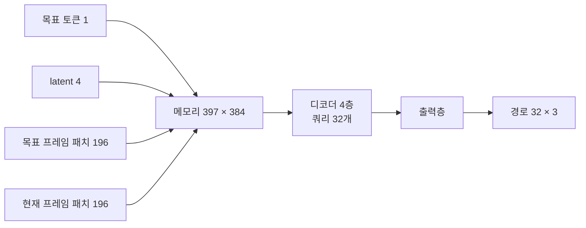
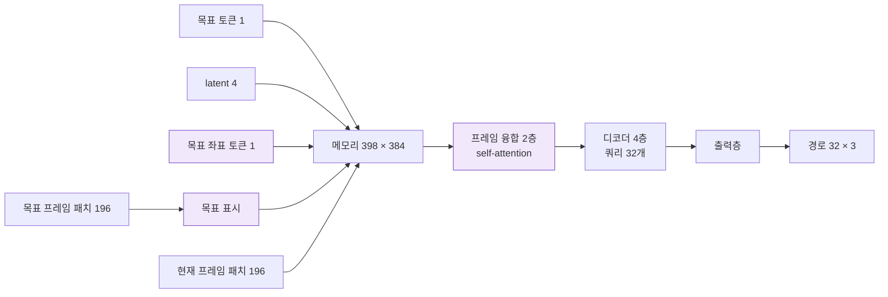
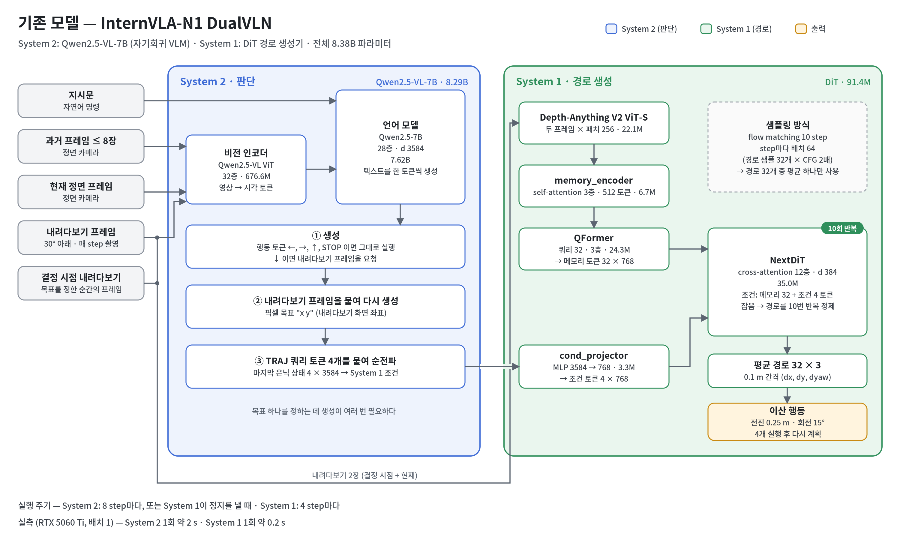
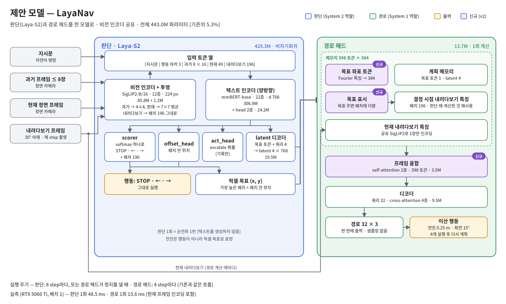
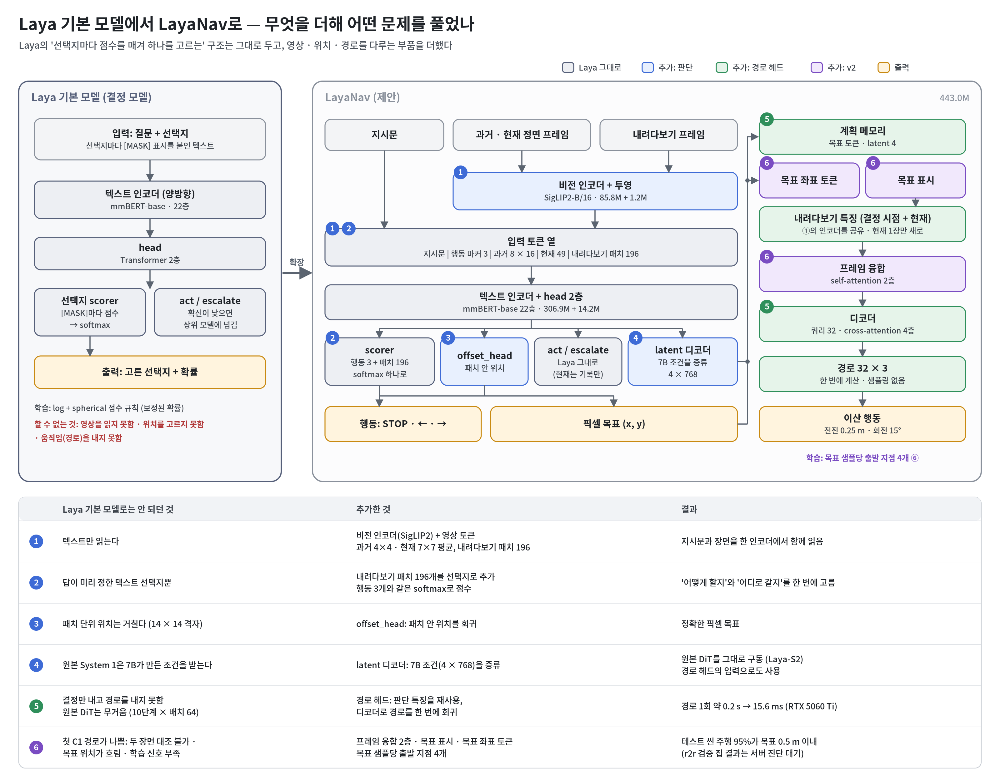

# v2: 경로 헤드 보강 (첫 C1 실패 대응)

> **대상: System 1 (경로 헤드, `traj_*` 모듈).** System 2(판단 모델 Laya-S2)와 공유 이미지 인코더(SigLIP2)는 바꾸지 않았다.
> System 구분은 [구현 보고서 1.1절](../IMPLEMENTATION_REPORT.md#11-system-1--system-2-구분), C2 이후의 개선점과 한계는 [11절](../IMPLEMENTATION_REPORT.md#11-현재-모델의-개선점과-한계-2026-10-06-c2-결과-기준)에 있다.

LayaNav = System 2 판단 모델(Laya-S2) + System 1 경로 헤드(DualVLN System 1 역할).

## 진단: 첫 C1의 실패 원인

첫 C1(v1)은 r2r 데이터로 경로 헤드만 학습했고, 경로 예측이 좋지 않았다. 원본 DualVLN System 1과 코드를 비교해 원인을 찾았다.

**원인이 아닌 것**: 정답 경로 생성은 원본과 같다.
- 프레임과 pose 정렬
- 경로 구간
- 카메라 pitch 보정
- 0.1 m 재표본과 4배 스케일
- 32스텝 자르기

| 원인 | 원본 System 1 | v1 | v2 대응 |
|---|---|---|---|
| 두 장면 비교 불가: 로봇이 움직인 뒤 목표가 지금 화면 어디인지 알려면 목표 시점 장면과 현재 장면을 대조해야 함 | 두 프레임 패치에 self-attention 3층 (`memory_encoder`) | 메모리 토큰끼리 attention 없음 | `traj_fuse` 2층 |
| 목표 위치 불명확 | 7B가 목표 좌표를 텍스트로 출력한 뒤의 hidden state | 목표 토큰에 섞여서만 전달 | `traj_goal_mark` + `traj_goal_xy` |
| 학습 신호 부족 | 목표 샘플당 출발 지점 최대 12개 | 1개 | 4개 (`--traj_starts 4`) |
| 고정된 이미지 특징 | 백본까지 학습 | C1에서 고정 | 그대로 (C2에서 학습) |

## 변경: 경로 헤드 v1 → v2

**v1**



**v2** (보라색이 신규)



| 모듈 | 역할 | 크기 | 파라미터 | v1 | v2 |
|---|---|---|---|---|---|
| `traj_mem_proj` | 목표 토큰·프레임 패치 투영 | 768 → 384 | 295,296 | ○ | ○ |
| `traj_latent_proj` | latent 투영 | 768 → 384 | 295,296 | ○ | ○ |
| `traj_goal_xy` | 목표 좌표 토큰 (Fourier 특징 → 투영) | 2 → 384 | 24,960 | | **신규** |
| `traj_seg` | 구간 임베딩 (메모리 / 목표 프레임 / 현재 프레임) | 3 × 384 | 1,152 | ○ | ○ |
| `traj_patch_pos` | 패치 위치 임베딩 (두 프레임 공유) | 196 × 384 | 75,264 | ○ | ○ |
| `traj_goal_mark` | 목표 주변 패치에 더하는 표시 벡터 (가우시안 가중, σ = 0.75 패치) | 384 | 384 | | **신규** |
| `traj_fuse` | 메모리 전체 self-attention (pre-LN, 6 head, FFN 1536) | 2층 | 3,548,928 | | **신규** |
| `traj_queries` | 출력 스텝별 쿼리 | 32 × 384 | 12,288 | ○ | ○ |
| `traj_decoder` | 쿼리 → 메모리 cross-attention (pre-LN, 6 head, FFN 1536) | 4층 | 9,466,368 | ○ | ○ |
| `traj_out` | LayerNorm + 선형 | 384 → 3 | 1,923 | ○ | ○ |
| **합계** | | | | **10.15M** | **13.72M** |

- **출력 형식**: 0.1 m 간격 32스텝의 `(dx, dy, dyaw)`이고, dx·dy는 4배 스케일이다. DualVLN System 1과 같은 형식이다.
- **함께 바꾼 것**: rxr, scalevln을 학습 데이터에 추가했다. 로더 수정 내용은 [구현 보고서 10절](../IMPLEMENTATION_REPORT.md)에 있다.

## 전체 구조 (v2 시점)



기존 모델은 Qwen2.5-VL-7B(System 2)가 텍스트를 생성해 목표를 정한다. DiT(System 1)는 경로 32개를 10단계 반복으로 뽑아 평균을 쓴다. 전체 8.38B다.



제안 모델은 판단과 경로 계산이 비전 인코더를 공유하는 한 모델이다(443.0M).
- **판단**: 순전파 한 번으로 행동 또는 픽셀 목표를 고른다.
- **경로**: 판단 때 계산한 특징을 재사용해 한 번에 계산한다.



LayaNav는 Laya의 결정 구조를 그대로 쓴다. 양방향 인코더, head 2층, 선택지 scorer, act/escalate 헤드, log + spherical 손실이다. 여기에 영상, 위치, 경로를 다루는 부품을 ①–⑥으로 더했다.

핵심은 ②다. 내려다보기 화면의 패치 196개를 행동과 같은 선택지로 취급해서, "어디로 갈지"도 Laya의 선택 방식으로 고른다.

## 비용 (RTX 5060 Ti, bf16, 배치 1)

| | v1 | v2 |
|---|---|---|
| 경로 계산 1회 | 14.7 ms | 15.6 ms |
| 경로 헤드 파라미터 | 10.15M | 13.72M |
| C1 학습 step | 1 | 약 1.4배 (출발 지점 4개) |

## 학습 (서버)

```bash
bash scripts/train/laya_s2/train_laya_nav.sh   # C1 → 진단 → C2 → 진단, TAG=laya_nav_mix
```

## 결과

C2 학습(`laya_nav_mix_c2`, r2r + rxr + scalevln, 96,318 step, 21시간) 기준이다. 자세한 수치는 [결과 노트](../results/laya_nav_mix_c2.md)에 있다.

**처음 보는 집 4곳, 경로 출발 지점 56,523개**

| 방식 | ADE / FDE | 방향 오차 |
|---|---|---|
| 정답 목표 사용 (System 1만) | **0.09 / 0.12 m** | 4.5° |
| 모델이 고른 목표 사용 (System 2 → System 1) | 0.37 / 0.55 m | 14.2° |
| 기준선: 평균 궤적 | 0.52 / 0.81 m | 7.5° |
| 기준선: 정지 | 0.95 / 1.29 m | – |

- **진단의 원인 1~3 (두 장면 비교, 목표 위치, 학습 신호)**: 해소됐다. 정답 목표 기준 경로 오차가 평균 궤적의 약 1/6이고, 검증 오차가 학습 끝(96k)까지 줄었다.
- **원인 4 (고정된 이미지 특징)**: 지금은 병목이 아니다. C2에서 인코더까지 학습했고 정답 목표 기준 경로가 정확하다.

**로컬 확인 (이 PC)**

| 확인 | 결과 |
|---|---|
| Habitat 테스트 씬, 정답 목표 | open-loop ADE 0.18 m, 주행 시 0.5 m 이내 도착 95% (최단 경로 상한과 같음) |
| Isaac Sim KIMM 주행 | 경로 헤드는 고른 목표까지 잘 간다. 판단이 지시문과 다른 목표를 골라 맴돌았다 |

**남은 병목은 System 2**다. 처음 보는 집에서 목표 패치 정확도는 0.45이고, 판단 부분은 28k step 이후 과적합된다(검증 행동 정확도 0.74 → 0.55). → [v3](v3_grounding.md)

R2R 폐루프 성공률(SR, SPL)과 원본 비교(`compare_laya_s2.sh`)는 아직 재지 않았다.
