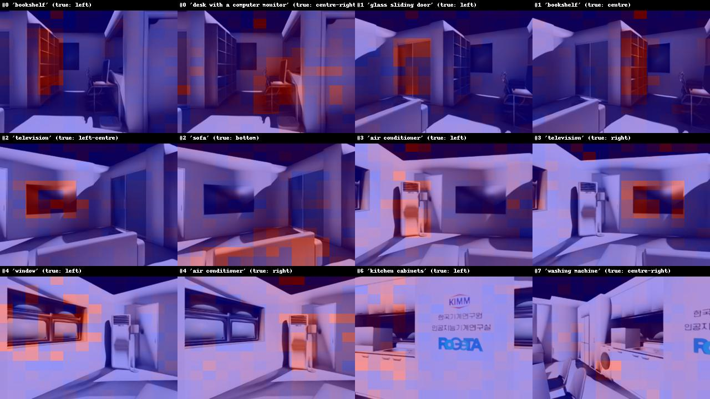
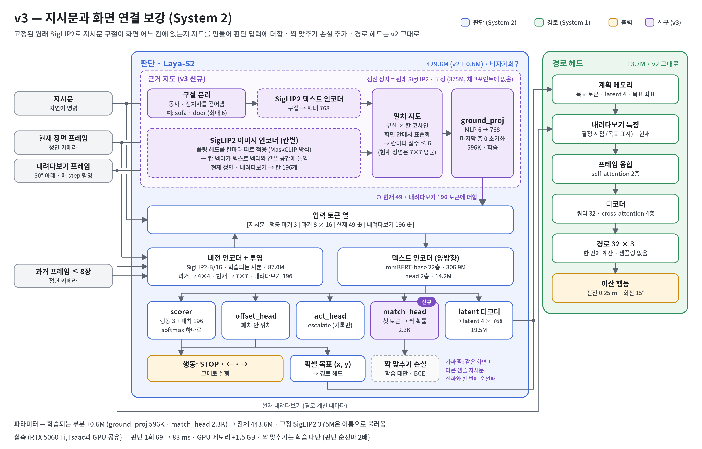

# v3: 지시문과 화면 연결 보강 (근거 지도 + 짝 맞추기)

> **대상: System 2 (판단 모델 Laya-S2).** 고정된 SigLIP2의 근거 지도를 판단 입력에 더한다. System 1 경로 헤드는 바꾸지 않았다.

## 진단

**서버 C2 결과 (오프라인)**: 병목은 System 2의 목표 선택이다. 처음 보는 집에서 목표 패치 정확도는 0.45다. 정답 목표를 주면 경로 오차가 0.09 m인데, 모델이 고른 목표로는 0.37 m가 된다([v2 결과](v2_path_head.md#결과), [보고서 11.3절](../IMPLEMENTATION_REPORT.md#113-한계)). 보고서는 "지시문과 화면을 잇는 능력"을 원인 후보로 꼽았지만, 다른 원인과 분리해 확인하지는 않았다.

**Isaac Sim KIMM 씬 확인 (2026-10-09)**: 위 원인 후보를 분리해 확인했다.

로봇을 제자리에서 돌며 찍은 8개 화면에, 물체만 바꾼 지시문 7개와 경로형 지시문을 줬다. 체크포인트는 `laya_nav_mix_c2/step_96318`이다.

| 확인 | 결과 |
|---|---|
| 원래 SigLIP2가 물체를 알아보나 | 예. 패치 단위 일치 지도가 12개 중 11개에서 해당 물체 위치를 가리킴 (그림) |
| LayaNav가 물체 이름에 반응하나 | **아니오.** 8개 화면 모두에서 7개 물체가 같은 행동. 출력 변화(TVD) 0.017 |
| 방향어 ("turn left" ↔ "turn right") | 약하게 반응. TVD 0.195 |
| 화면을 바꾸면 | TVD 0.364. **행동은 대부분 화면이 정함** |



**원인 (추정)**: 지시문을 읽는 mmBERT는 텍스트로만 사전학습됐다. 그래서 "소파"라는 단어와 화면 속 소파를 잇는 법을 R2R 내비게이션 데이터에서만 배워야 했다. R2R 지시문은 경로 설명이 대부분이라 물체를 목표로 지정하는 경우가 적다.

## 변경



보라색이 v3에서 더한 부분이다. 점선 상자는 학습하지 않는 원래 SigLIP2이고, 경로 헤드는 v2와 같다.

**1. 근거 지도 (`--grounding 1`, `grounding.py`)**

1. 지시문을 구절(최대 6개)로 나누고, 동사와 전치사를 걷어내 랜드마크만 남긴다.
   - 예: `Walk to the sofa, then stop next to the TV` → `sofa`, `TV`
2. 고정된 원래 SigLIP2로 구절마다 **패치별 일치 지도**를 만든다.
   - 대상: 현재 정면 49토큰, 내려다보기 196토큰
   - 방법: 풀링 헤드를 패치마다 따로 적용하는 MaskCLIP 방식
3. 작은 MLP(`ground_proj`, 구절 6 → 768)로 지도를 각 패치 토큰에 더한다.

마지막 층은 0으로 초기화한다. 기존 체크포인트에 붙여도 처음 출력은 같다(실측 차이 0.0).

**2. 짝 맞추기 손실 (`--w_match`)**

1. 같은 화면에 다른 샘플의 지시문을 붙인 가짜 짝을 만든다.
2. 첫 토큰 위의 `match_head`가 진짜와 가짜를 구별하도록 학습한다.
3. 진짜와 가짜를 한 번의 순전파로 계산한다(GPU 여러 장 학습 호환).

지시문을 무시하고 화면만 보면 이 손실을 줄일 수 없으므로, 지시문을 반드시 읽게 된다.

## 비용 (RTX 5060 Ti, Isaac과 GPU 공유 중)

| 항목 | 값 |
|---|---|
| 판단 1회 | 69 → 83 ms (SigLIP2 영상 1회 추가, 구절 임베딩은 캐시) |
| GPU 메모리 | 고정 SigLIP2 약 1.5 GB 추가. 체크포인트에는 저장하지 않고 이름으로 불러옴 |
| 학습 | 짝 맞추기를 켜면 판단 순전파가 2배 |

## 학습 (서버)

C2의 **step_28000**에서 이어서 학습한다. 판단 부분이 과적합되기 전이고 System 2가 가장 좋은 시점이다. 새 부품만 0에서 시작하고 나머지는 그대로 가져온다.

```bash
git pull
python scripts/train/laya_s2/train_laya_nav.py --stage c2 --init_from checkpoints/laya_nav_mix_c2/step_28000 \
    --vln_dataset_use r2r_125cm_0_30,rxr_125cm_0_30,scalevln_125cm_0_30 \
    --grounding 1 --w_match 0.2 --lr_text 1e-5 --epochs 1 --batch_size 32 --num_workers 16 \
    --output_dir checkpoints/laya_nav_v3_c2
```

- **첫 실행**: SigLIP2 토크나이저 파일을 HF에서 받는다(공개 모델).
- **배치 크기**: 짝 맞추기 때문에 판단 순전파가 2배다. 48은 H200에서 메모리가 부족해 32로 학습했다.
- **과적합 대응**:
  - 텍스트 인코더 학습률을 기본 3e-5에서 1e-5로 낮췄다.
  - 최종 체크포인트는 `last`가 아니라 검증 `acc_goal`, `acc_action`이 가장 좋은 `step_*`로 고른다(2000 step마다 검증).
- **경로 품질이 C2보다 떨어지면**: 고른 체크포인트에서 판단을 고정하고 경로 헤드만 다시 학습한다([보고서 11.4절](../IMPLEMENTATION_REPORT.md#114-개선-방향-우선순위-순)의 C3 방식).

## 확인

| 확인 | 방법 | 기대 |
|---|---|---|
| 목표 선택 (오프라인) | 학습 로그 `[val step]`, `eval_traj.py` | `acc_goal` 0.45보다 높음. 모델이 고른 목표로 경로 오차 0.37 m보다 낮음 |
| 물체 이름 반응 | Isaac KIMM: `CKPT=…/laya_nav_v3_c2/step_<고른 step> bash start_kimm.sh` 후 `siglip_check.py` | 같은 화면, 다른 물체의 TVD가 0.017보다 크게 늘고, 물체마다 행동이 달라짐 |
| 경로 품질 유지 | `eval_traj.py` | C2와 비슷 |
| 주행 성능 | `compare_laya_s2.sh` (R2R 300 에피소드) | C2보다 SR, SPL 향상 |

## 결과

`laya_nav_v3_c2`: C2 `step_28000`에서 64,213 step(13.7시간, batch 32) 더 학습했다. 로컬 확인은 `step_64000`으로 했다. 수치 기록은 [결과 노트](../results/laya_nav_v3_c2.md)에 있다.

**목표 선택 (서버 검증, 처음 보는 집, C2와 같은 검증 설정)**

| 지표 | C2 | v3 |
|---|---|---|
| `acc_goal` (최고 / 최종) | 0.465 / 0.447 | 0.454 / 0.454 |
| `acc_action` (최고 / 최종) | 0.743 / 0.554 | 0.736 / 0.634 |
| 정답 목표 경로 ADE (최종) | 0.091 m | 0.093 m |
| 짝 맞추기 정확도 `acc_match` | – | 0.68 → 0.81 |

- **목표 선택 정확도는 그대로다.** 기대(0.45보다 높음)에 못 미쳤다.
- **판단 과적합은 줄었지만 남아 있다.** 최종 `acc_action`은 0.55에서 0.63이 됐지만, 검증 `l_dec`는 여전히 2.5에서 3.2로 오른다.
- **경로 품질은 유지됐다.**
- 모델이 고른 목표 기준 경로 오차(`eval_traj.py --own_goal`)와 R2R 폐루프 SR·SPL은 아직 재지 않았다.

**물체 이름 반응 (KIMM 화면 8장 × 물체 7개, `siglip_check.py`)**

| 체크포인트 | 같은 화면, 물체만 바꿀 때 TVD | 물체와 상관없이 같은 행동인 화면 | 좌우 방향 일치 |
|---|---|---|---|
| C2 `step_28000` (v3 시작점) | 0.007 | 8 / 8 | 0.46 |
| C2 `step_96318` | 0.017 | 8 / 8 | 0.56 |
| **v3 `step_64000`** | **0.041** | **4 / 8** | **0.67** |
| v3, 근거 지도를 0으로 | 0.012 | 7 / 8 | 0.49 |

**좌우 방향 일치**는 물체 위치가 다른 두 지시문을 비교했을 때, 모델이 물체가 있는 쪽(SigLIP2가 판단한 위치)으로 더 기우는 비율이다. 133쌍을 비교했고, 0.5면 우연 수준이다.

- **물체 이름에 반응하기 시작했고, 기우는 방향도 대체로 맞다.**
- **이 효과는 근거 지도에서 나온다.** 근거 지도를 끄면 C2 수준으로 돌아간다. `ground_proj` 마지막 층도 0에서 시작해 크기 17까지 커졌다(영상 투영층은 33).
- **반응은 아직 약하다.** 화면 절반에서는 어떤 물체를 말해도 행동이 같다.

**KIMM 주행 (사용자 직접 주행, 2026-10-10)**

2, 3번째 주행은 앞 주행이 끝난 자리에서 시작했다.

| 지시문 | 결과 |
|---|---|
| Walk to the bookshelf and stop. | 7.4 m 이동, 책장 앞에서 STOP. 도착 후 제자리에서 우회전을 약 20번 한 뒤 정지 |
| Walk to the wooddesk and stop. | 7.6 m 이동, 책상 줄 끝(마지막 의자 옆)에서 STOP |
| Walk to the airconditioner and stop. | 주방 쪽으로 가다 멈춤. 같은 경로를 3번 냈지만 위치가 변하지 않았다(내려다보기 화면 왼쪽의 의자에 걸린 것으로 보임). 에어컨은 화면에 보이지 않았다 |

사용자 소감은 "간단한 곳은 잘 주행한다"였다.

**정리**: 근거 지도는 의도한 효과(물체 이름에 반응)를 냈지만 아직 약하고, 오프라인 목표 정확도는 오르지 않았다.

**서버 학습 중 오류**: 구절 캐시가 5만 개를 넘어 비워질 때, 이번 배치가 쓸 구절까지 지워지는 버그가 있었다(`KeyError: 'stairs'`, 3,980 step에서 중단). `grounding.py`에서 고쳤고 회귀 테스트를 추가했다.
